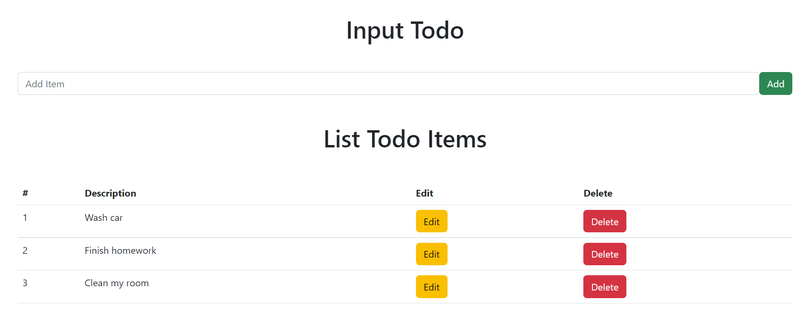

# PERN Stack TODO list app
> PERN Stack TODO application for practice.
> Simple CRUD application.

## Table of Contents
* [General Info](#general-information)
* [Technologies Used](#technologies-used)
* [Features](#features)
* [Screenshots](#screenshots)
* [Setup](#setup)
* [Usage](#usage)
* [Project Status](#project-status)
* [Room for Improvement](#room-for-improvement)
* [Acknowledgements](#acknowledgements)
* [Contact](#contact)
<!-- * [License](#license) -->

## General Information
- Postgres DB
- ExpressJS Server API (Server Folder)
- React Front-End (Client Folder)
- Node
<!-- You don't have to answer all the questions - just the ones relevant to your project. -->

## Technologies Used
- PERN Stack
- Server run with "nodemon start"
- Client run with "npm start"

## Features
List the ready features here:
- Its all great

## Screenshots

<!-- If you have screenshots you'd like to share, include them here. -->

## Setup
What are the project requirements/dependencies? Where are they listed? A requirements.txt or a Pipfile.lock file perhaps? Where is it located?

Proceed to describe how to install / setup one's local environment / get started with the project.

- Install necessary node modules

## Usage
How does one go about using it?
Provide various use cases and code examples here.

`write-your-code-here`

## Project Status
Project is: _complete_

## Room for Improvement
Include areas you believe need improvement / could be improved. Also add TODOs for future development.

Room for improvement:
- Improvement to be done 1
- Improvement to be done 2

To do:
- Feature to be added 1
- Feature to be added 2

## Acknowledgements
- Developed this application following the tutorial by "The Stoic Programmers" on YouTube.
- This project was based on [this tutorial](https://www.youtube.com/watch?v=5vF0FGfa0RQ&t=3143s).

## Contact
Readme template created by [@flynerdpl](https://www.flynerd.pl/) - feel free to contact me!

<!-- Optional -->
<!-- ## License -->
<!-- This project is open source and available under the [... License](). -->

<!-- You don't have to include all sections - just the one's relevant to your project -->